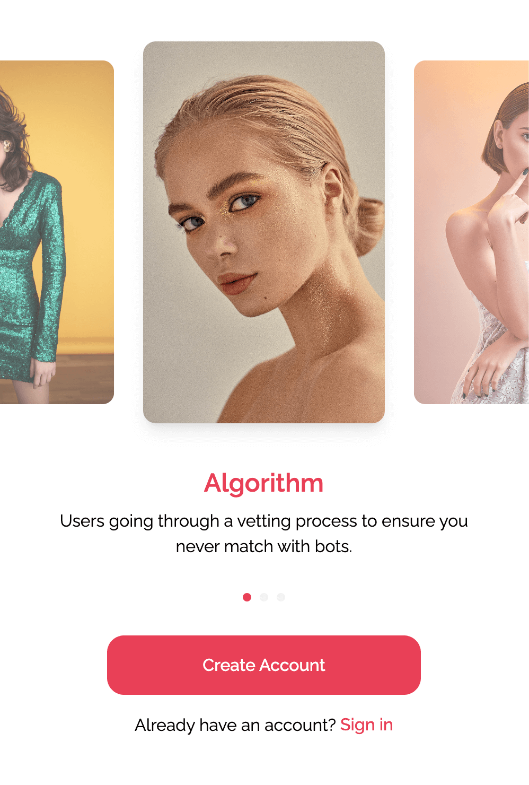
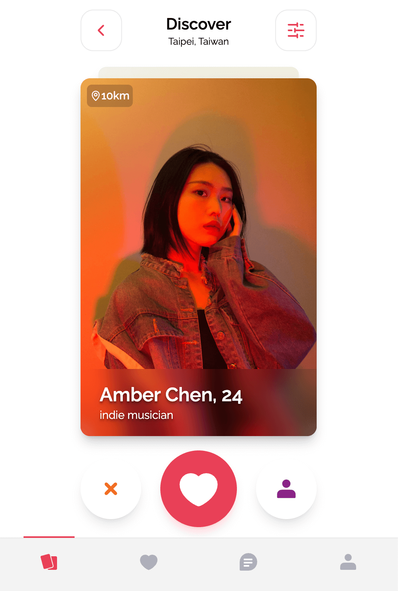
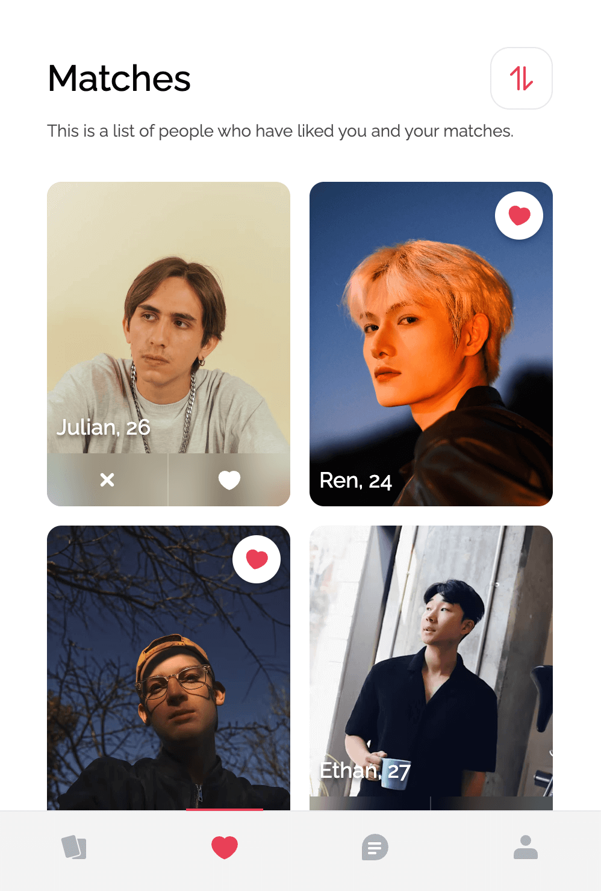
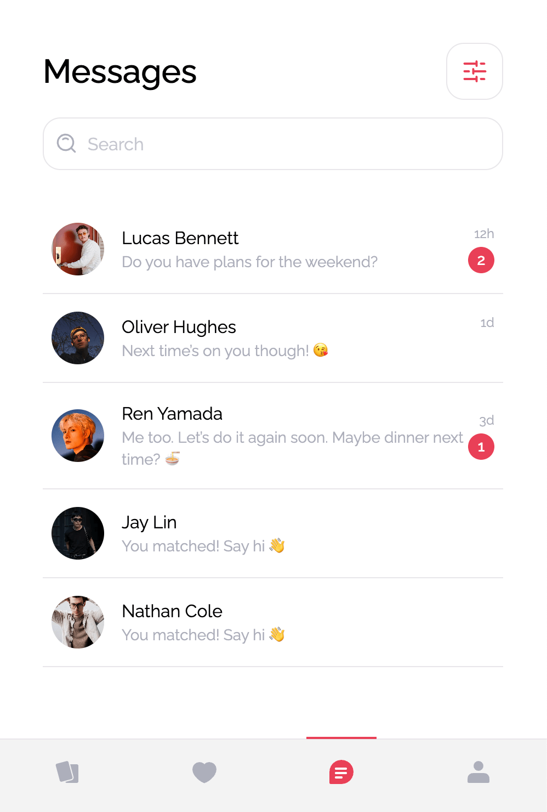
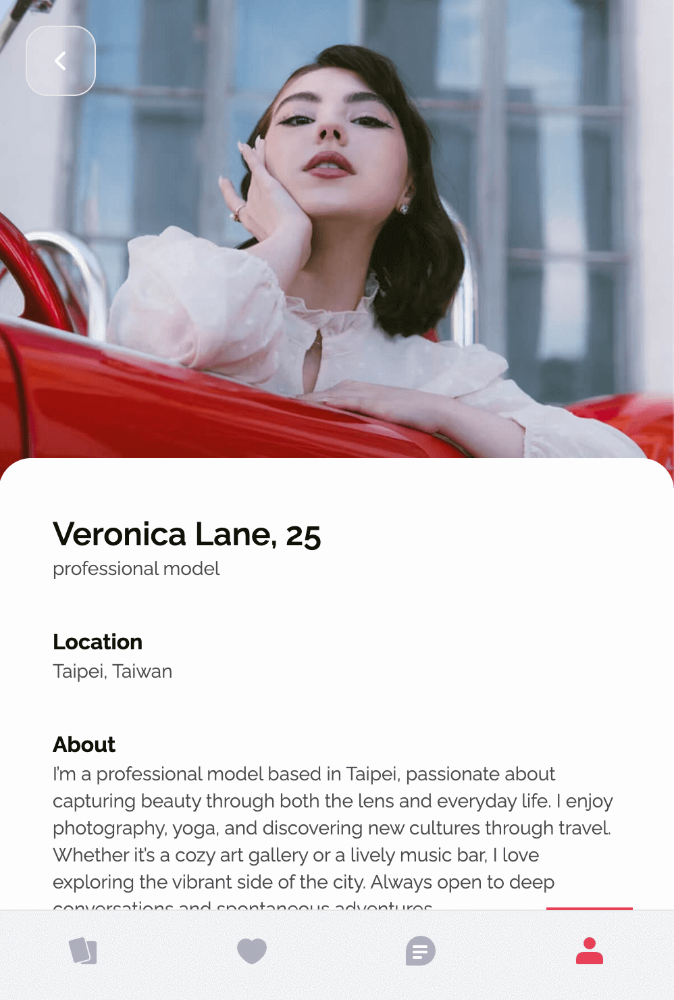

# Dating‑App

Project status

- ✅ Development environment is fully set up
- ✅ Core UI structure and routing are implemented
- ✅ Initial global state (Context API) is in place
- ✅ Mock API (JSON Server) is running and populated
- 🔧 Base components (Cards, Badges, Inputs) are ready
- 🚧 Core features (match, like, chat, filter) are still in progress

## Tech Stack

| Layer            | Choice            | Reason                      |
| ---------------- | ----------------- | --------------------------- |
| Build & Dev      | Vite              | Fast start & HMR            |
| UI               | React             | Mature ecosystem            |
| UI components    | shadcn/ui         | Tailwind-native, accessible |
| Styling          | Tailwind CSS v4   | Utility-first, themeable    |
| Language         | TypeScript 5      | Static type checking        |
| State Management | React Context     | Lightweight shared state    |
| Custom Hooks     | `useXxx()` hooks  | Logic reuse & separation    |
| Mock API         | JSON Server       | Simple to setup mock API    |
| Lint/Format      | ESLint + Prettier | Auto lint & format          |

## Getting Started

```bash
# 1 – Install dependencies
npm install

# 2 – Start the React dev server  ➜  http://localhost:5173
npm run dev

# 3 – In another terminal, start the mock REST API  ➜  http://localhost:4000
npm run json-server
```

## Explore the App

<p align="center">

  
  
  
  
</p>

1. [Home Page](http://localhost:5173/)

- Static carousel landing page showcasing featured content or highlights.
- Originally intended to include login with Facebook and SMS verification, but these features are not implemented yet.

2. [Discover Page](http://localhost:5173/discover)

- Browse potential match candidates based on your selected filters.
- You can like or skip users using the available action buttons.

3. [Matches Page](http://localhost:5173/matches)

- View the list of users who have liked you.
- You can choose to like or remove users who haven’t been responded to yet.
- A heart icon will appear on a user’s card when both users have liked each other — indicating a successful match!
- View other user profiles in detail.

4. [Messages Page](http://localhost:5173/messages)

- Chat with users you’ve matched with.
- Each conversation is shown in a dedicated chat window.
- View other user profiles in detail.

5. [Profile Page](http://localhost:5173/profile/user-1)

- View your personal profile.
- This includes your name, age, interests, location, and photo gallery.

### NPM Scripts

| Script        | Description                                |
| ------------- | ------------------------------------------ |
| `dev`         | Launch Vite with HMR                       |
| `build`       | Type‑check then create a production bundle |
| `preview`     | Serve the built bundle locally             |
| `lint`        | Run ESLint                                 |
| `format`      | Run Prettier over the workspace            |
| `json-server` | Start the mock REST API                    |

> **Proxy note** – During development, all requests starting with `/api/*` are transparently proxied to `http://localhost:4000`. See the `vite.config.ts` file.

## Current Structure

```bash
├─ mock/
│  └─ db.json                 # Mock API
├─ public/
├─ src/
│  ├─ assets/                 # Icons & static assets
│  ├─ components/             # Shared components
│  │  ├─ ui/                  # shadcn/ui primitives (button, card, etc.)
│  │  ├─ inputs/              # Input variants
│  │  ├─ chat/                # Chat-specific components
│  │  └─ badges/              # Badge variants like InterestBadge, DistanceBadge
│  ├─ constants/              # Static options (interests, filters)
│  ├─ contexts/               # React Context providers
│  │  └─ UserDataContext.tsx  # User info & auth context
│  ├─ lib/
│  │  ├─ hooks/               # Custom hooks like useMatchedUserIds
│  │  └─ utils/               # Utility functions like `cn`
│  ├─ pages/                  # Route-level pages like MessagesPage, ProfilePage
│  ├─ App.tsx
│  ├─ main.tsx
│  ├─ index.css
│  └─ vite-env.d.ts
├─ eslint.config.js
├─ tsconfig.json
├─ vite.config.ts
└─ index.html
```

## Assignment Requirements (to be implemented)

- [x] Display a recommendation list with user cards.
- [x] Like / Skip interactions.
- [ ] User authentication via Facebook or SMS.
- [ ] Real‑time chat between matched users.
- [x] Location switch to fetch recommendations from a different region.
- [x] Search filters: age range, gender, distance.
- [x] Responsive layout for desktop & mobile web.
